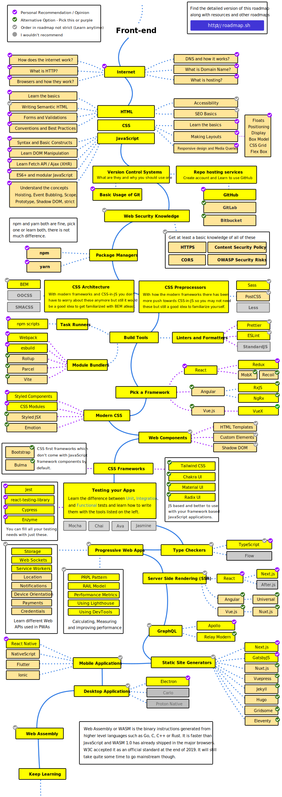

# Development training - Frontend

The Goal of the project is to increase the programming skills from zero to middle level.

## Summary and links

1. Front-end

    1.1 [Frontend Developer Roadmap](https://roadmap.sh/frontend)

    1.2 [Projects to learn and practice](#12-projects-to-learn-and-practice)

    1.3 [Projects' repository](https://github.com/felipefialho/frontend-challenges)

### 1.1 Roadmap

> Note: This roadmap was elaborated and is avaliable on [Roadmap.sh's site](https://roadmap.sh/frontend).

### 1.2 Projects to learn and practice

**Site**: [Frontend Practice](https://www.frontendpractice.com/projects)

**Category**: start at level 1

---------
**Site**: [Frontend Mentor](https://www.frontendmentor.io/)

**Category**: Newbie

**Technologies recommented**: HTML, CSS, JS.

----------
**Card validation**

* **Technology recomented**: React.js/Vue.js/Angular
* **Topics**: Status Hooks and events.
----------

